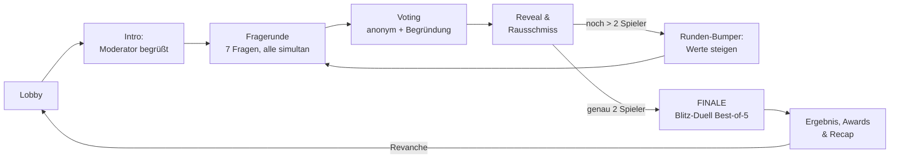
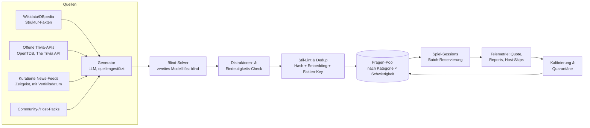
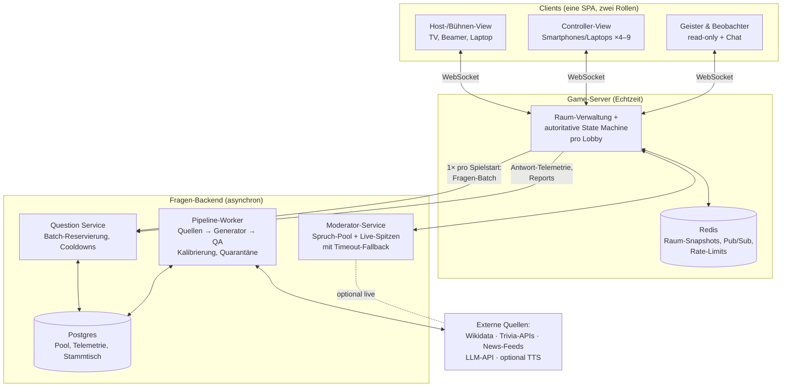
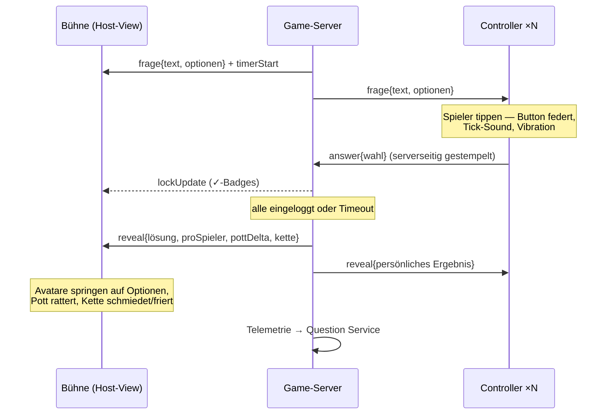

# KICKED OUT — Der Dümmste fliegt

**Konzept- & Umsetzungsdokument · Version 1.0 · Stand: 18.08.2026**

> **Das Spiel ist gebaut — und hat sich beim Bauen weiterentwickelt.** Dieses Dokument beschreibt den ursprünglichen Entwurf; die lauffähige Umsetzung liegt im selben Repository (`npm install && npm start`, siehe [README.md](./README.md)).
>
> Zwei Entscheidungen weichen bewusst ab: Antworten werden **frei getippt** statt aus vier Optionen gewählt (§1.3 und Annahme A3), und beim Voting wählt die Runde die **dümmste Antwort** statt eines Spielers mit Pflicht-Begründung (§1.4). Beides zielt auf dasselbe: Unter Zeitdruck getippte Antworten sind der eigentliche Spaß, und der Rauswurf soll daran hängen. Außerdem startet das Spiel schon **ab zwei Personen** (dann direkt als Duell) und läuft am PC in einem Fenster — Bühne und Eingabe zusammen.

Ein Browser-Partyquiz für 4–9 echte Menschen in Echtzeit. Ein großer, gemeinsamer Screen (TV/Beamer/Laptop) zeigt die Show, jedes Smartphone wird zum persönlichen Buzzer. Richtige Antworten füllen den gemeinsamen Pott, falsche lassen die Kette gefrieren — und nach jeder Runde entscheidet ein anonymes Voting mit Pflicht-Begründung, wer fliegt. Kein Download, keine Accounts, keine KI-Mitspieler. Nur ein bissiger KI-Moderator, der die Rauswürfe kommentiert.

---

## Inhalt

0. [Elevator Pitch, Designprinzipien & Annahmen](#0-elevator-pitch-designprinzipien--annahmen)
1. [Spielablauf-Struktur](#1-spielablauf-struktur)
2. [UI/UX pro Screen](#2-uiux-pro-screen)
3. [Sound- & Animationsmomente](#3-sound--animationsmomente)
4. [Fragen-Pipeline: frische Fragen ohne Wiederholung](#4-fragen-pipeline-frische-fragen-ohne-wiederholung)
5. [Zusatzfeatures & Wiederspielwert](#5-zusatzfeatures--wiederspielwert)
6. [Technische Grobarchitektur](#6-technische-grobarchitektur)
7. [Ausbaustufen: MVP → V1 → V2](#7-ausbaustufen-mvp--v1--v2)
8. [Offene Fragen an dich](#8-offene-fragen-an-dich)

---

## 0. Elevator Pitch, Designprinzipien & Annahmen

### Pitch

**KICKED OUT** ist „Der Dümmste fliegt" fürs Wohnzimmer und den Discord-Call: Alle beantworten gleichzeitig dieselben Wissensfragen, gemeinsam wird ein Pott aufgebaut — aber am Ende jeder Runde wird einer rausgewählt. Anonym. Mit Begründung. Und der KI-Moderator liest die fiesesten Begründungen genüsslich vor. Die letzten zwei duellieren sich im Finale um den Pott.

Das Spiel lebt von drei Spannungen:

1. **Kooperation vs. Verrat** — der Pott gehört allen, aber gewinnen kann nur einer.
2. **Wissen vs. Taktik** — fliegt der Schwächste (er kostet Punkte) oder der Stärkste (er ist die größte Gefahr im Finale)?
3. **Anonymität vs. Entlarvung** — die Votes sind geheim, die Begründungen werden öffentlich zelebriert.

### Designprinzipien (Rangfolge)

1. **Look & Feel zuerst.** Jede Interaktion fühlbar: Bounce, Squash & Stretch, Konfetti, Sound, Haptik. Kein Formular-Gefühl, nirgends. Referenzrahmen: Codenames Online (Aufgeräumtheit), Gartic Phone (Verspieltheit), Make It Meme (Tempo & Frechheit).
2. **Der große Screen ist die Bühne, das Handy ist der Buzzer.** Alles Dramatische passiert auf dem gemeinsamen Screen; das Handy zeigt nur, was ich gerade tun kann.
3. **Immer beschäftigt, nie verloren.** Auch Rausgeflogene bleiben im Spiel (Geister-Modus). Jede Phase hat einen Timer, niemand wartet auf Nachzügler.
4. **Drama ist choreografiert.** Rausschmiss, Kettenbruch und Finale sind inszenierte Momente mit fester Beat-Struktur (siehe §3.3), keine Statusmeldungen.
5. **Server hat immer recht.** Punkte, Timer, Votes und Lösungen leben ausschließlich serverseitig (Fairness, Anti-Cheat, Reconnect).
6. **Fragen sind Frischware.** Kein endlicher Katalog; eine Pipeline erzeugt, prüft und rotiert laufend neue Fragen (§4).

### Getroffene Annahmen (bitte bestätigen/korrigieren, siehe §8)

| # | Annahme | Begründung |
|---|---|---|
| A1 | **Sprache: Deutsch first**, Architektur mehrsprachig vorbereitet | Format & Zielgruppe sind deutsch |
| A2 | **Kein Echtgeld** — der Pott ist Punkte/Ruhm | Rechtlich & inhaltlich einfachste Lösung |
| A3 | **Multiple Choice (4 Optionen) als Standard**, Freitext als späterer Modus | MC ist auto-validierbar, schnell, handytauglich |
| A4 | **Session-Ziel: 25–40 Minuten**, auch bei 9 Spielern | Party-Attention-Span; via Doppelrausschmiss geregelt |
| A5 | **Keine Accounts im MVP** — Nickname + Avatar reichen | Einstiegshürde null, DSGVO-freundlich |
| A6 | **Eigenständige Marke.** Wir übernehmen die Spielidee (Quiz + Kette + Rauswahl), aber keine geschützten Namen, Logos oder Catchphrases der TV-Formate. Unser Rausschmiss-Satz ist ein eigener („**Du fliegst!**"). | Formatrechte-Hygiene |

---

## 1. Spielablauf-Struktur

### 1.1 Phasen-Überblick

Der Server führt diese Phasen als strikte State Machine; jede Phase hat einen serverseitigen Timer und einen definierten Übergang. Kein Client kann Phasen erzwingen.

### 1.2 Lobby

- **Host** öffnet `kickedout.app` → „Lobby erstellen" → bekommt **Raum-Code (4 Buchstaben)**, Teilen-Link und QR-Code auf dem großen Screen.
- **Mitspieler** öffnen den Link oder tippen den Code ein (kein Download, kein Login): Nickname (max. 12 Zeichen, Schimpfwortfilter) + **Avatar-Baukasten** (Form × Farbe × Accessoire, in 10 Sekunden fertig, garantiert unterscheidbar).
- **Host-Einstellungen** (auf dem Handy des Hosts, Vorschau auf dem großen Screen):
  - Rundenlänge: Blitz (5 s/Frage) · **Standard (10 s)** · Gemütlich (15 s)
  - Kategorien-Mix: Allgemeinwissen / Wissenschaft / Geografie einzeln zuschaltbar (Standard: alle drei)
  - Voting: **Anonym (Standard)** oder Klartext-Modus (Votes öffentlich — für hartgesottene Gruppen)
  - Zusatzoptionen (V1+): Joker-Karten an/aus, Zeitgeist-Fragen an/aus, eigenes Fragen-Pack
- Start erst ab **4 Spielern**; alle drücken **„Bereit"** (der Bereit-Tap schaltet gleichzeitig den Audio-Kontext des Geräts frei, siehe §6.2). Countdown 3-2-1, Show-Vorhang öffnet sich.
- Late-Joiner nach Spielstart landen automatisch im **Geister-Modus** (Zuschauer, §1.6) und spielen bei der Revanche mit.

### 1.3 Fragerunde: Kette & Pott

**Ablauf pro Runde:** Kategorien-Roulette (2 s Animation) → 7 Fragen im Schnellfeuer-Gefühl. Jede Frage:

1. Frage + 4 Antwortkarten erscheinen auf dem großen Screen; die Handys zeigen dieselben 4 Antworten als große Buttons.
2. **Alle antworten simultan.** Timer läuft (Standard 10 s). Sobald **alle** eingeloggt haben, geht es sofort weiter — das erzeugt das Schnellfeuer-Tempo, ohne dass Runden unplanbar lang werden.
3. **Reveal (4 s):** richtige Antwort leuchtet auf, Avatare aller Spieler springen auf die Option, die sie gewählt haben (Kahoot-artige Verteilung — man sieht sofort, *wer* „Sydney" für Australiens Hauptstadt hielt). Pott tickt hoch, Kette reagiert.
4. Nicht beantwortet (Timeout/Disconnect) zählt als falsch.

**Die Mechanik (Herzstück, bewusst simpel und bühnentauglich):**

- Jede Frage hat einen **Basiswert** nach Schwierigkeit und Rundennummer (siehe Tabelle unten).
- **Pott:** Jede richtige Antwort zahlt `Basiswert × Ketten-Multiplikator` in den gemeinsamen Pott ein.
- **Kette (Multiplikator ×1 bis ×5):** Beantworten **alle** Spieler eine Frage richtig („Perfekte Frage"), wird ein glühendes Kettenglied geschmiedet: Multiplikator +1. **Eine einzige falsche Antwort friert die Kette ein**: Eis-Overlay, Splitter-Sound, Multiplikator zurück auf ×1 — und alle sehen, wer der Kettenbrecher war.
- Der Pott ist der **Preis fürs Finale**: Wer gewinnt, „nimmt den Pott mit" (Punkte für die Lobby-/Stammtisch-Rangliste und pure Angeberei; Pott-Höhe steuert außerdem die Konfettimenge im Siegerscreen).
- **Individuelle Statistik** läuft unsichtbar mit: Trefferquote, Ø-Antwortzeit, Kettenbrüche, eingezahlte Punkte. Sie füttert Voting-Kontext, Moderator-Sprüche, Awards und Recap.

**Werte-Rampe & Pacing** (Ziel: jede Runde ≈ 3–3,5 Min., Session gesamt 25–40 Min.):

| Runde | Basiswert leicht/mittel/schwer | Schwierigkeits-Mix | Timer |
|---|---|---|---|
| 1 | 100 / 150 / 200 | 70 % / 25 % / 5 % | 10 s |
| 2 | 150 / 200 / 300 | 55 % / 35 % / 10 % | 10 s |
| 3 | 200 / 300 / 400 | 40 % / 40 % / 20 % | 9 s |
| 4 | 250 / 400 / 550 | 25 % / 45 % / 30 % | 8 s |
| 5 | 300 / 500 / 700 | 15 % / 45 % / 40 % | 8 s |

**Rundenanzahl nach Spielerzahl** (Doppelrausschmiss hält lange Abende kurz):

| Spieler | Rausschmisse bis Finale | Modus | Runden + Finale |
|---|---|---|---|
| 4 | 2 | einfach | 2 + F |
| 5 | 3 | einfach | 3 + F |
| 6 | 4 | einfach | 4 + F |
| 7 | 5 | einfach | 5 + F |
| 8 | 6 | Runde 1 = **Doppelrausschmiss** | 5 + F |
| 9 | 7 | Runde 1 + 2 = **Doppelrausschmiss** | 5 + F |

### 1.4 Voting: anonym, mit Pflicht-Begründung

- Frage auf dem großen Screen: **„Wer fliegt raus?"** — darunter alle verbliebenen Spieler mit Rundenbilanz *in grober Auflösung* (z. B. „3/7 richtig · 1 Kettenbruch"), damit auch Unaufmerksame informiert voten.
- Auf dem Handy: Kandidaten antippen (sich selbst wählen ist gesperrt) + **Pflicht-Begründung**:
  - **Schnell-Chips** (rotierender Vorrat, z. B. „Kettenbrecher!", „Zu langsam …", „Zu stark — Finalgefahr", „Reine Sympathiefrage", „Hauptstadt-Legasthenie") **oder**
  - **Freitext** (3–100 Zeichen, Schimpfwortfilter in Schärfegrad „Party").
  - Absenden erst möglich, wenn Kandidat **und** Begründung gesetzt sind.
- Timer 45 s. Wer nicht abstimmt, enthält sich (zählt nicht — aber der Moderator merkt es sich für eine Spitze).
- Großer Screen zeigt nur den Fortschritt („5 von 7 haben abgestimmt"), niemals Zwischenstände.
- **Anonymität ist heilig:** Die Zuordnung Vote→Wähler verlässt den Server nie, auch nicht im Recap. (Ausnahme: bewusst aktivierter Klartext-Modus.)

### 1.5 Reveal & Rausschmiss (choreografiert)

1. Musik duckt weg, Licht-Vignette, Moderator: *„Die Stimmen sind ausgezählt."*
2. **Vote-Karten fliegen einzeln** in zufälliger Reihenfolge auf die Spielerporträts und stapeln sich hörbar; die letzte Karte kommt mit Extra-Verzögerung.
3. **Begründungen** erscheinen als anonyme Sprechblasen; der Moderator pickt sich die beste heraus und liest sie vor (Text-Marquee, optional TTS).
4. **Gleichstand → Blitz-Stechen:** Die punktgleich Meistgewählten bekommen sofort 1 Schätzfrage (Zahleneingabe, z. B. „Wie lang ist die Donau in km?"); wer näher dran ist, bleibt. Kein Warten, alle anderen sehen zu und fiebern mit. *(Variante für Puristen, per Lobby-Option: „Chef-Entscheid" — der statistisch Rundenbeste entscheidet öffentlich.)*
5. **Der Rausschmiss:** Spotlight auf den Verlierer, alle anderen dimmen ab. Moderator-One-Liner (personalisiert, nie zweimal derselbe, §1.7). Stempel **„DU FLIEGST!"** knallt aufs Porträt, der Stuhl kippt nach hinten, der Avatar wird **im hohen Bogen aus dem Bild katapultiert** (Cartoon-Schrei, Kamera-Shake), Tür knallt.
6. Sanfter Übergang: Der Rausgeflogene materialisiert als **Geist** in der Geisterzone (Plopp + „Buh!"-Soundchen) — der Ton bleibt liebevoll, nicht bösartig.
7. **Runden-Bumper:** „Runde 3 — die Fragen sind jetzt 200 Punkte wert. Die Kette wartet." → nächste Fragerunde.

### 1.6 Geister-Modus (Rausgeflogene bleiben im Spiel)

- Geister sehen alles, **chatten** und feuern **Emoji-Regen** auf den großen Screen.
- **Geister-Tipp:** Vor jedem Voting tippen sie, wer fliegt; richtige Tipps geben Geister-Punkte → eigene Mini-Rangliste und der Award „Prophet" im Recap.
- Im Finale setzen die Geister öffentlich auf einen Finalisten (Stimmungs-Balken auf dem großen Screen).
- Geister stimmen **nicht** über Rausschmisse ab und beantworten keine Wertungsfragen — echte Menschen entscheiden das Spiel, Geister machen die Halle voll.

### 1.7 Der KI-Moderator

- **Rolle:** Ansagen, Übergänge, Spitzen — niemals Mitspieler, niemals Fragensteller-Autorität (Fragen kommen aus der Pipeline, §4).
- **Ton:** trocken-bissig mit Herz; Härtegrad in der Lobby wählbar: „Charmant" / **„Bissig" (Standard)** / „Gnadenlos" (und „Absurd" als Unlock, §5).
- **Nie zweimal derselbe Spruch:** Sprüche kommen aus einem groß vorproduzierten, getaggten Pool (Situation × Ton × Platzhalter wie `{name}`, `{falsche_antwort}`, `{votezahl}`). Der Server führt pro Lobby (und pro Stammtisch-Gruppe über Spiele hinweg) ein Verbraucht-Set; der Pool wird von der Pipeline laufend nachgefüllt (§6.5).
- **Kontext-Spitzen (Signature-Feature):** Der Moderator referenziert echte Spielereignisse: *„{name}, du hast heute dreimal die Kette gesprengt — die Eiskönigin ruft an, sie will ihr Gimmick zurück."* Für besonders spitze Personalisierung kann live ein LLM-Call mit hartem Timeout (800 ms) versucht werden; schlägt er fehl, greift lautlos der Pool.
- **Auftritte:** Begrüßung, Rundenübergänge, Kettenbruch (kurz!), Voting-Anmoderation, Vorlesen der besten Begründung, Rausschmiss-One-Liner, Finale-Anheizen, Siegerehrung.

### 1.8 Finale (letzte 2)

1. **Versus-Splash:** Beide Avatare krachen von den Seiten ins Bild, Blitz-Effekt, Kampfansage des Moderators. Der Pott hängt sichtbar über der Bühne.
2. **Kategorien-Draft:** Abwechselnd wählt jeder Finalist aus je 3 angebotenen Kategorien-Karten (Frage 1 wählt A, Frage 2 wählt B, …). Frage 5 ist immer **„Chaos"** (Zufallskategorie, schwer).
3. **Blitz-Duell, Best-of-5:** Beide antworten simultan. Beide richtig → **der Schnellere** holt den Punkt. Einer richtig → Punkt. Beide falsch → kein Punkt. Erster mit 3 Punkten gewinnt; Punktestand als Tauziehen-Kette zwischen den Avataren.
4. **Matchball-Inszenierung:** Hintergrund färbt sich dunkelrot, Herzschlag-Sound, Timer pulsiert.
5. Bei 0:0-Blockade nach 5 Fragen: Sudden-Death-Schätzfrage (wie Blitz-Stechen).
6. Geister und der große Screen sind reine Arena: Wett-Balken, Emoji-Regen, Anfeuer-Buttons.

### 1.9 Ergebnis-Screen & Recap

1. **Krönung:** Sieger-Avatar auf dem Podest, Krone fällt von oben, Fanfare, Konfettikanonen (Menge skaliert mit Pott-Höhe), Pott zählt sichtbar auf das Konto des Siegers.
2. **Awards-Karussell** (automatisch aus der Statistik, je 3 s):
   - **Blitzmerker** — schnellste richtige Antworten
   - **Kettensäge** — meiste Kettenbrüche
   - **Giftzunge** — beste Begründung (von allen im Recap per Schnell-Vote gekürt)
   - **Stehaufmännchen** — meiste überlebte Gegenstimmen
   - **Prophet** — bester Geister-Tippgeber
3. **Highlight-Recap:** 4–6 automatisch erkannte Momente (höchste Kette, knappster Rausschmiss, dramatischstes Blitz-Stechen, lustigste Begründung) als kurze Slideshow.
4. **Teilbare Recap-Karte** (Bild, client-seitig gerendert): Sieger, Pott, Awards, ein Zitat — Datenschutz-Schalter: nur Avatare & Nicknames, Teilen ist immer opt-in.
5. **„Revanche"-Button:** gleiche Lobby, gleiche Codes, Geister sind wieder dabei, Statistik zählt auf den Stammtisch (§5) ein.

---

## 2. UI/UX pro Screen

### 2.1 Designsprache

**Art Direction: „Studio-Glow"** — die Bühnenhaftigkeit einer TV-Show, übersetzt in die freundliche, aufgeräumte Cartoon-Moderne von Codenames Online / Gartic Phone. Dunkle, warme Studio-Nacht als Grundfläche, damit Karten, Kette und Konfetti leuchten können. Alles ist rund, dick, drückbar.

**Farbwelt (Tokens):**

| Token | Wert (Richtwert) | Verwendung |
|---|---|---|
| `bg-stage` | Verlauf `#1E1B4B → #312E81 → #4C1D95`, animiert | Bühnen-Hintergrund, permanent in langsamer Bewegung |
| `card` | `#FFF8EF` (Creme) | Frage- & Antwortkarten, maximale Lesbarkeit |
| `ink` | `#1E1B4B` | Text auf Karten |
| `correct` | `#2DD4A8` (Mint) | richtig, Erfolg, „Bereit" |
| `wrong` | `#FF5C5C` (Koralle) | falsch, Gefahr, Rausschmiss |
| `gold` | `#FFC94D` | Pott, Kette, Sieg |
| `vote` | `#8B5CF6` (Lila) | Voting-Phase, Geister |
| `info` | `#5AA7FF` | Neutral, Timer, Chips |

Jede Spielphase hat eine **Leitfarbe** (Fragerunde = Info-Blau/Creme, Voting = Lila, Rausschmiss = Koralle, Finale = Gold), die Hintergrund-Gradient und Akzente übernimmt — man spürt den Phasenwechsel, bevor man ihn liest.

**Typografie:**

- **Display/Headlines:** eine runde, fette Display-Schrift (Richtung *Baloo 2* oder *Fredoka*) — Buchstaben mit Bauch, leicht gequetscht animierbar.
- **UI & Fragen:** *Nunito Sans* oder *Inter*, Fragen auf dem großen Screen min. ~48 px (3-Meter-Lesbarkeit), Zahlen (Timer/Pott) als Tabular Figures.
- Sprache im UI: kurz, direkt, du-Form, leichte Show-Ironie („Einer von euch hat gleich frei.").

**Komponenten-Grammatik:** Karten mit 16–24 px Radius und weichem Drop-Shadow; Buttons mit sichtbarer „Dicke" (unterer Hard-Shadow), die beim Drücken physisch einfedern (Scale 0.96 + Shadow-Kollaps, Spring-Easing); Chips für Kategorien/Schwierigkeit; Avatare als Sticker mit weißem Rand. Micro-Interactions überall: Hover-Wobble, Einlog-Häkchen mit Pop, tippende Punkte im Chat, Konfetti-Bursts bei Highlights.

**Animierter Hintergrund (Pflicht):** dreischichtiges Parallax — (1) langsam wandernder Farbverlauf, (2) driftende weiche Partikel/Bokeh, (3) themennahe Silhouetten (Fragezeichen, Kettenglieder, Papierflieger), die träge durchs Bild ziehen. Reagiert auf Ereignisse: Kettenbruch lässt Frost über die Ränder kriechen, im Finale wandern Spotlight-Kegel. Immer unter 60 % Sättigung der Vordergrund-Elemente — Bühne, nie Konkurrenz. `prefers-reduced-motion` wird respektiert (statischer Verlauf, keine Parallax).

### 2.2 Host-Screen (der große Screen), Phase für Phase

**Konstante Bühnen-Elemente:** oben links **Pott & Kette** (Kettenglieder als Physik-Objekte, die sich schmieden/vereisen), oben rechts **Runden-/Kategorien-Chip + Timer**, unten **Chat-Ticker & Emoji-Regen-Zone**, Mitte = Bühne.

| Phase | Layout & Kern-Ideen |
|---|---|
| **Lobby** | Riesiger Raum-Code + QR mittig; joinende Avatare ploppen mit Namens-Sticker in eine Reihe und winken (Idle-Animationen); Einstellungs-Panel als Karte rechts; Bereit-Status als Häkchen-Sticker. |
| **Fragerunde** | Fragekarte mittig-oben (max. 2 Zeilen), darunter 2×2 Antwortkarten in vier Eckfarben; Timer als schrumpfender Leuchtring um die Fragennummer; unten Avatar-Leiste, eingeloggte Spieler bekommen ein „✓"-Badge (ohne Korrektheit!). |
| **Antwort-Reveal** | Richtige Karte pulsiert mint & wächst, falsche sacken grau ab; Avatare springen auf ihre gewählte Antwort (Verteilungsbild); Pott-Zähler rattert hoch, Kettenglied schmiedet sich (Funken) **oder** Frost + Splittern beim Bruch. |
| **Voting** | „Wer fliegt raus?" in Display-Type; Spielerkarten im Halbkreis mit grober Rundenbilanz; Fortschritt „5/7 haben abgestimmt"; Hintergrund kippt ins Lila, Musik wird sparsamer. |
| **Reveal/Rausschmiss** | Beat-Choreografie aus §1.5: fliegende Vote-Karten, anonyme Begründungs-Sprechblasen, Moderator-Band unten, Spotlight, Katapult. Der dramaturgische Höhepunkt — hier sitzt das Animations-Budget. |
| **Finale** | Splitscreen mit beiden Großporträts, Tauziehen-Kette als Score, Kategorien-Draft als Kartenfächer, Geister-Wettbalken am Rand. |
| **Ergebnis** | Podest + Krone + Konfetti; Awards-Karussell; Recap-Slideshow; QR „Recap-Karte aufs Handy"; großer „Revanche"-Button. |

**Praktisch:** Der Host-Screen ist nur eine URL — für Remote-Runden teilt man ihn per Screenshare, oder jeder öffnet zusätzlich den read-only **Beobachter-Link**.

### 2.3 Mobile Controller (das Handy), Phase für Phase

Grundregeln: alles Wichtige in der **unteren Daumenzone**, Touch-Targets ≥ 56 px, jede Eingabe quittiert mit Animation + Sound-Tick + Vibration (wo verfügbar), Wake Lock hält den Bildschirm an. Das Handy zeigt nie Sieger-Drama — das gehört der Bühne; es zeigt **meinen** Status.

| Phase | Controller-Inhalt |
|---|---|
| **Join/Lobby** | Code-Eingabe mit Riesenziffern → Nickname → Avatar-Baukasten (3 Swipe-Reihen: Form/Farbe/Accessoire) → fetter **„Bereit!"**-Button (bounct, schaltet Audio frei). Darunter Mini-Chat. |
| **Fragerunde** | Frage als Textzeile oben (für Weitsitzer & Remote-Spieler), darunter die 4 Antwort-Buttons groß, in denselben Farben & derselben Reihenfolge wie die Bühne; nach dem Tipp: Button rastet ein („Eingeloggt!"), Rest dimmt, dezenter Puls bis zum Reveal. Umentscheiden bis Timer-Ende erlaubt. |
| **Reveal (persönlich)** | Vollflächiges, kurzes Feedback: mint „+300 in den Pott!" oder Koralle „Daneben." — plus Sonderfall „Du hast die Kette gebrochen 🥶" (einmalig pro Frage, sanfte Häme). |
| **Voting** | Kandidatenliste mit Avataren, Antippen = Auswahl mit Wackel-Animation; Begründung: Chip-Reihe + Freitextfeld; Absenden-Button füllt sich erst, wenn beides gesetzt ist; danach „Stimme ist im Umschlag ✉️" + Warteanimation. |
| **Rausschmiss (persönlich)** | Überlebende: kurzes „Du bleibst." Der Getroffene: Bildschirm kippt, „DU FLIEGST!", starke Vibration — und sofort das freundliche Onboarding in den Geister-Modus („Deine neuen Superkräfte: Chat, Emoji-Regen, Prophezeiungen"). |
| **Geister-Modus** | Chat im Fokus, Emoji-Regen-Buttons (rate-limited mit Cooldown-Ring), Geister-Tipp vor jedem Voting, Finale-Wette. |
| **Finale (die 2)** | Wie Fragerunde, plus Kategorien-Draft (3 Karten zum Antippen), Matchball-Warnfarbe. |
| **Ergebnis** | Persönliche Statistik-Karte (Quote, Speed, Awards), „Recap-Karte teilen", „Revanche". |

### 2.4 Live-Chat & Reaktionen — mit Spoiler-Schleuse

- Chat ist immer da: Eingabe auf dem Handy, sichtbar als Ticker auf der Bühne + kompakter Verlauf auf den Handys. Emojis fliegen als Physik-Partikel über den großen Screen.
- **Spoiler-Schleuse (wichtig!):** Während das Antwortfenster offen ist, werden Nachrichten *lebender Spieler* nicht sofort angezeigt, sondern serverseitig gepuffert und **beim Reveal gesammelt freigelassen** — niemand kann „C!!!" vorsagen, und der Nachrichtenschwall zum Reveal ist ein eigener Comedy-Beat. Geister chatten währenddessen ungebremst in einem sichtbar „geisterhaften" Stil (halbtransparent).
- Rate-Limit (1 Nachricht/2 s, Emoji-Cooldown), Schimpfwortfilter Stufe „Party" (Härte konfigurierbar), Host kann Chat stummschalten.

### 2.5 Barrierefreiheit & Robustheit

- Farben nie alleinige Information: richtig/falsch zusätzlich per Icon (✓/✕), Form und Position; Antwortfarben kolorenblind-tauglich gewählt.
- Bühnen-Typo auf 3 m Distanz getestet; Kontraste WCAG AA auf Karten.
- `prefers-reduced-motion` → ruhige Varianten aller Pflichtanimationen; globaler Sound-Mixer (Musik/SFX/Moderator getrennt) auf Host wie Handy.
- Reconnect-freundlich (§6.3): Handy-Lock oder Funkloch ≠ Rauswurf; verpasste Frage zählt als falsch, mehr nicht.

---

## 3. Sound- & Animationsmomente

### 3.1 Musik-System (adaptive Ebenen)

Ein durchgehender **Ambient-Loop** pro Phase, in Schichten gebaut (Pad → Percussion → Melodie), die der Client stufenlos zumischt: Mit jeder Runde kommt eine Schicht dazu — Runde 5 *klingt* gefährlicher als Runde 1. Voting zieht auf einen reduzierten Suspense-Puls zusammen, das Finale bekommt ein eigenes, schnelleres Thema. Der Moderator duckt die Musik automatisch (Sidechain). Musik läuft standardmäßig **nur auf der Bühne**; Handys spielen nur persönliche SFX + Haptik (kein Krach-Chaos aus 9 Lautsprechern).

### 3.2 Trigger-Matrix (Auszug — die Pflichtmomente vollständig)

| Moment | Sound | Animation | Haptik (Handy) |
|---|---|---|---|
| Spieler joint Lobby | weiches „Plopp" | Avatar bounct rein, winkt | kurzer Tick (Joiner) |
| Alle bereit / Start | Show-Jingle, ansteigend | Vorhang öffnet, Titel-Splash | Doppel-Tick |
| Countdown 3-2-1 | Ticks steigend, Auftakt-Boom | Riesenziffern mit Squash | Tick pro Ziffer |
| Frage erscheint | Whoosh + Kartenschnalzen | Karte flippt ein, Optionen kaskadieren | — |
| Antwort eingeloggt | satter „Thock" | Button federt, Häkchen-Pop | kurzer Impuls |
| Letzte 3 s Timer | Herzschlag beschleunigt | Ring pulsiert rot | Puls-Pattern |
| **Richtige Antwort (Reveal)** | Chime-Arpeggio aufwärts | Karte pulsiert mint, Avatare hüpfen drauf | Erfolgs-Doppelpuls |
| **Falsche Antwort (Reveal)** | gedämpfter „Donk" abwärts | Karte sackt grau ab, Avatar-Wackeln | einzelner Buzz |
| Pott steigt | Münz-Geratter, Zähler-Ticks | Counter rattert, Goldpartikel zur Kette | — |
| Kettenglied geschmiedet | Amboss-Klang + Schimmer | Glied glüht, Funken, ×-Anzeige pumpt | — |
| **Kette friert ein** | Eisknacken + Glassplittern | Frost kriecht ins Bild, Glieder zerspringen | langer Buzz (Verursacher) |
| Voting öffnet | Suspense-Pad, tiefer Puls | Licht dimmt, Lila-Kipp, Karten fächern | Tick |
| Stimme abgegeben | Papiergleiten + Stempel | Umschlag fliegt davon | kurzer Impuls |
| **Voting-Reveal** | Trommelwirbel, pro Karte „Flap-Thud" | Vote-Karten fliegen & stapeln, letzte verzögert | — |
| Blitz-Stechen | Alarm-Sting | Blitz-Splash, Split-Screen der Betroffenen | starker Puls (Betroffene) |
| **Rausschmiss** | 1 s Stille → One-Liner → Boing + Cartoon-Schrei + Türknall | Spotlight, Stempel, Stuhl kippt, Katapult, Kamera-Shake | lange Vibration (Getroffener) |
| Geist erscheint | luftiges „Huuu" (freundlich) | Rauchwölkchen, Geister-Sticker | sanfter Puls |
| Finale-Splash | Versus-Fanfare, Crowd-Rumble | Avatare krachen rein, Blitz, Shake | Doppelpuls (Finalisten) |
| Matchball | Herzschlag + tiefes Drone | Hintergrund rötet sich, Timer pulsiert | Puls-Pattern |
| **Sieger-Fanfare** | volle Fanfare + Konfettikanonen-„Pops" | Podest, Krone fällt, Konfetti-Physik, Pott zählt | Feier-Pattern (Sieger) |
| Awards | kurzer Jingle je Award | Karussell-Karten mit Stempel | — |
| Chat-Emoji-Regen | leises Prasseln (gedeckelt) | Emoji-Partikel mit Physik | — |

### 3.3 Signature-Momente (hier sitzt das Budget)

1. **Der Kettenbruch** — vom Amboss-Glück zur Eiszeit in 1,5 s: der meist-memeable Moment im Spiel, klar einem Verursacher zuordenbar, aber mit Augenzwinkern inszeniert.
2. **Der Rausschmiss** — die 8-Sekunden-Beat-Folge aus §1.5. Die eine Sekunde **Stille** vor dem One-Liner ist der wichtigste Sound des Spiels.
3. **Die Krönung** — Konfettimenge = Pott-Höhe; ein guter gemeinsamer Lauf *fühlt* sich am Ende größer an.

### 3.4 Technik-Notizen zu Sound/Haptik

- SFX als **Audio-Sprites** (eine Datei, Zeitfenster) via Web Audio; Latenz < 50 ms fürs Drück-Gefühl.
- Mobile-Autoplay-Sperren: Audio-Kontext wird mit dem ersten „Bereit!"-Tap freigeschaltet.
- Vibration API: Android/Chrome ja, **iOS Safari nein** — Haptik ist Zusatzwürze, nie Informationsträger; iOS kompensiert mit Micro-Animationen.

---

## 4. Fragen-Pipeline: frische Fragen ohne Wiederholung

### 4.1 Anforderungen

1. Kategorien: **Allgemeinwissen, Wissenschaft, Geografie** (erweiterbar).
2. **Keine Wiederholungen** — weder im Spiel, noch für dieselbe Gruppe über Wochen.
3. **Laufender Nachschub** statt endlichem Katalog; optional tagesaktuelle Fragen.
4. **Qualität:** keine falschen/veralteten Fakten, genau eine vertretbare richtige Antwort, plausible Distraktoren, sauberes Deutsch.
5. **Kalibrierte Schwierigkeit** für die Runden-Rampe (§1.3).

### 4.2 Grundsatzentscheidung: Fragen sind Vorratsware, nie Live-Ware

Fragen werden **asynchron produziert, geprüft und eingelagert** — niemals live während eines Spiels von externen Quellen oder einem LLM erzeugt. Das entkoppelt Spielerlebnis (Latenz null, Ausfall unmöglich) von Beschaffung (darf langsam und gründlich sein). „Frisch" heißt: Der **Pool erneuert sich täglich**, nicht: die Frage entsteht in dem Moment.

### 4.3 Die Quellen im Detail

1. **Wikidata/DBpedia (Rückgrat für Geografie & Wissenschaft):** SPARQL-Abfragen liefern verifizierte Fakten-Tripel (Hauptstädte, Flüsse, Elemente, Planeten, Erfinder …). **Frage-Templates** je Faktentyp formen daraus natürliche Fragen; **Distraktoren werden aus derselben Entitätsklasse mit ähnlicher Bekanntheit gezogen** (falsche Flüsse zu einer Fluss-Frage — plausibel, aber sicher falsch, weil gegen die Datenbank geprüft). Richtigkeit ist hier *konstruktionsbedingt* gegeben; die Kombinatorik ist praktisch unerschöpflich.
2. **Offene Trivia-APIs (OpenTDB, The Trivia API u. a.):** großer, sofort nutzbarer Grundstock, aber überwiegend englisch → LLM-**Lokalisierung** (nicht bloß Übersetzung: Maße, Bezugsraum, Kulturkontext eindeutschen), danach volle QA-Strecke wie bei allem anderen. Lizenzhinweise (z. B. CC BY-SA bei OpenTDB) werden im Datensatz mitgeführt.
3. **LLM-Generierung, quellengestützt:** Batch-Jobs ziehen Themen-Seeds (z. B. rotierende Wikipedia-Exzerpte) und erzeugen Fragen **mit Quellenzitat-Pflicht**: Die Antwort muss wörtlich aus dem mitgelieferten Quelltext belegbar sein — freies Halluzinieren ist damit strukturell unterbunden. Liefert die Breite fürs Allgemeinwissen und Formulierungs-Vielfalt.
4. **Zeitgeist-Fragen (optional, Lobby-Schalter):** Kuratierte, seriöse News-Feeds (z. B. tagesschau/dpa-Meldungen) → LLM formt Fragen mit **Verfallsdatum (TTL 7–30 Tage)** und Quellenlink; nach Ablauf automatische Aussortierung. Deckt „aktuell & frisch" ab, ohne dass Altbestände veralten können.
5. **Community-/Host-Packs (V1, §5):** private Packs sofort spielbar (nur die eigene Runde), öffentliche Packs erst nach Moderations-Queue.

### 4.4 Mehrstufige Qualitätssicherung

Jede Frage durchläuft vor Einlagerung:

1. **Blind-Solver:** Ein zweites, unabhängiges Modell beantwortet die Frage, *ohne* die intendierte Lösung zu kennen. Abweichung → Ablehnung. (Fängt falsche Fakten **und** missverständliche Formulierungen.)
2. **Distraktoren-Check:** Der Solver muss jeden Distraktor sicher als falsch einstufen; „vertretbar auch richtig" → Ablehnung (Eindeutigkeit).
3. **Stil-Lint:** Länge (Bühne: max. 2 Zeilen), keine Doppel-Verneinung, keine „Alle/Keine der genannten", saubere deutsche Typografie, Schwierigkeits-Ersteinschätzung.
4. **Dedup dreifach:** Normalisierter Text-Hash (exakte Dubletten) + **Embedding-Ähnlichkeit** (umformulierte Dubletten, Cosine > 0,92) + **Fakten-Key** (gleiches Wissens-Tripel wie „Hauptstadt(Frankreich)=Paris" → Cooldown, egal wie formuliert).
5. **Stichproben-Humanreview:** x % jeder Charge manuell (anfangs hoch, sinkt mit Vertrauen); Quellen-/Zitatpflicht macht den Review schnell.

**Und im Betrieb (der eigentliche Qualitätsmotor):**

- **Melden-Button** im Reveal (ein Tap) und **„Frage kaputt"-Notfallknopf des Hosts** (ersetzt die Frage sofort im Spiel und flaggt sie). N Reports → automatische Quarantäne + Review.
- **Statistik-Anomalien:** Eine „leichte" Frage mit 25 % Trefferquote oder verdächtigem Antwortmuster wird automatisch zur Prüfung gezogen.
- **Schwierigkeits-Kalibrierung:** Ersteinschätzung des Generators wird laufend durch echte Trefferquoten ersetzt (mit Shrinkage bei kleinen Fallzahlen): leicht ≥ 75 %, mittel 45–75 %, schwer < 45 %. Die Runden-Rampe aus §1.3 zieht immer aus den *empirisch* kalibrierten Töpfen.

### 4.5 Nie-Wieder-Sehen-Mechanik (Rotation)

- **Session-Sperre:** Beim Spielstart reserviert der Server einen Batch (~3× erwarteter Bedarf) passend zur Lobby-Konfiguration; innerhalb eines Spiels sind Wiederholungen ausgeschlossen. Notfall-Reservepaket liegt gebündelt im Client (Pipeline-Ausfall ≠ Spielabbruch).
- **Gruppen-Gedächtnis:** Pro Stammtisch/Lobby-Gruppe merkt sich der Server gesehene Fragen-Hashes **90 Tage** — wer jede Woche spielt, sieht trotzdem nichts doppelt.
- **Globaler Cooldown:** Nach M Ausspielungen pausiert eine Frage N Tage; Fakten-Keys haben eigene Cooldowns (auch die *umformulierte* Hauptstadt-Frage pausiert).
- **Bestands-Wächter:** Mindestfüllstand je Topf (Kategorie × Schwierigkeit × Sprache, z. B. ≥ 500 ungesehene Fragen); Unterschreitung triggert automatisch Nachschub-Jobs. Ein kleines Dashboard zeigt Poolgesundheit, Reportquoten, Kalibrier-Drift.

### 4.6 Runden-Mix

Pro Runde mischt der Server nach der Rampe aus §1.3, mit Constraints: nie zweimal dieselbe Kategorie in Folge, jede aktivierte Kategorie min. 2× pro Runde, Zeitgeist-Fragen (falls aktiv) max. 1 pro Runde und klar als „🗞️ Zeitgeist" gebadged. Das Kategorien-Roulette zu Rundenbeginn ist reine Inszenierung des bereits gezogenen Mixes.

---

## 5. Zusatzfeatures & Wiederspielwert

Nach Ausbaustufen sortiert (Priorisierung siehe §7):

**V1 — direkte Wiederspielwert-Treiber**

1. **Stammtisch-Modus:** Ein merkbarer Gruppen-Code macht wiederkehrende Runden persistent: Saison-Rangliste („Ruhm" = mitgenommene Pötte), ewige Awards-Bilanz, Nemesis-Statistik („Du hast 4× für Lena gestimmt"), Gruppen-Gedächtnis für Fragen (§4.5). Keine Accounts nötig — der Code ist die Gruppe.
2. **Eigene Fragen-Packs:** Host tippt vor dem Abend 5–15 eigene Fragen ein (oder CSV-Import) → werden als „Insider"-Fragen eingestreut (deutlich gebadged). Der Moment, in dem die WG-Frage „Wer hat den Herd angelassen?" zwischen zwei Geografie-Fragen auftaucht, ist Gold. Öffentliches Teilen von Packs erst mit Moderations-Queue.
3. **Highlight-Recap & teilbare Karte** (aus §1.9) — der Share-Kanal, über den neue Gruppen vom Spiel erfahren.
4. **Moderator-Härtegrade** inkl. Unlock-Persönlichkeit „Absurd" (Dada-Vergleiche statt Häme).

**V1.1 — Würze**

5. **Sabotage-Joker (Lobby-Schalter, standardmäßig aus):** verdient durch persönliche 3er-Serien, **max. 1 aktiver Joker pro Spieler und Runde**, Einsatz geheim, Auflösung theatralisch im Reveal:
   - **Zeitdieb** — allen anderen 3 s vom Timer stehlen
   - **Nebelbombe** — bei einem Gegner werden für die nächste Frage die Antwortpositionen durchgewürfelt (stiftet Verwirrung, verrät aber nichts)
   - **Doppelt oder nichts** — eigene nächste Antwort zählt ×2 in den Pott oder friert bei Fehler die Kette *persönlich zugeordnet* ein
   - **Schutzschild** — annulliert im nächsten Voting genau 1 Stimme gegen mich (wird beim Reveal sichtbar: eine Karte zerplatzt)
   - **Spiegel** — leitet 1 Stimme gegen mich auf den Wähler zurück (nur im Klartext-Modus, sonst auf Zufall unter den Mitwählern)
   Balance-Leitplanke: Joker erzeugen **Chaos & Comedy, nie Mathe-Vorteile** > ~10 % Pott-Impact.
6. **Geister-Ausbau:** Prophezeiungs-Rangliste über Spiele hinweg; einmal pro Spiel eine kollektive **„Geisterstunde"** (alle Geister wählen gemeinsam eine harmlose Störung für die nächste Frage, z. B. Spiegelschrift-Frage — kündigt sich groß an, trifft alle Lebenden gleich).
7. **Themenabende:** Kuratierte Mix-Presets („Nur Geografie: Weltreise", „Wissenschaft: Labornacht") mit eigenem Bühnen-Reskin (Farb-/Partikel-Variante — günstig, wirkt wie neuer Content).

**V2 — Reichweite**

8. **Teilbare Video-Clips:** Die Signature-Momente (Kettenbruch, Rausschmiss, Matchball) werden als kurze Clips (Replay der Animations-Events, client-seitig gerendert) exportierbar — TikTok-/WhatsApp-tauglich, immer opt-in aller Beteiligten.
9. **Turnier-Modus:** 2+ Lobbys, Sieger-Bracket, gemeinsamer Finalabend.
10. **Publikums-Schwarm:** Zuschauer ohne Spielerplatz (z. B. Twitch-Chat) voten als aggregierter „10. Geist" bei Wetten & Geisterstunde mit.

---

## 6. Technische Grobarchitektur

Bewusst hochgehalten: Komponenten, Verantwortlichkeiten, Datenflüsse — keine Implementierungsdetails.

### 6.1 Überblick

**Kernprinzip:** Der Spielpfad (Clients ↔ Game-Server ↔ Redis) hat **null externe Abhängigkeiten zur Laufzeit** — Fragen-Batch und Moderator-Pool werden beim Spielstart geladen, alles Externe (LLM, Quellen, TTS) läuft asynchron daneben.

### 6.2 Frontend

- **Eine SPA** (TypeScript; z. B. React/Svelte + Vite) mit Routen `/host`, `/join/CODE` (Controller), `/watch/CODE` (Beobachter). Gleiche Codebasis, gleiche State-Synchronisation, unterschiedliche Views — Host-Wechsel ist damit trivial (URL auf anderem Gerät öffnen).
- **Animation:** CSS + Spring-Bibliothek (z. B. Motion) für UI-Federn; Canvas-Layer (z. B. Pixi/tsParticles) für Hintergrund, Konfetti, Emoji-Physik; Lottie o. ä. für die Signature-Momente. Alle Effekte hängen an *State-Events*, nicht an eigener Logik.
- **Audio:** Web-Audio-Sprites (§3.4), Layer-Mixer für adaptive Musik, Ducking für Moderator; Freischaltung über den „Bereit!"-Tap.
- **Mobile-Details:** PWA-fähig (aber nie Pflicht), Screen Wake Lock, Vibration API (Android), Safe-Area-Layouts, Offline-Reservepaket an Fragen im Bundle.

### 6.3 Echtzeit & Spielzustand

- **Transport:** WebSockets (z. B. Socket.IO) mit Raum pro Lobby; Reconnect mit Session-Token aus dem localStorage.
- **Autoritative State Machine** pro Raum (Phasen aus §1.1): Timer, Punkte, Kette, Votes und Lösungen existieren **nur serverseitig**. Clients senden Absichten, der Server sendet Zustands-Snapshots + Ereignis-Deltas.
- **Beispiel-Ereignisse:**
  - Client → Server: `join`, `ready`, `answer{frageId, wahl}`, `vote{ziel, begründung}`, `chat{text}`, `joker{typ}`, `hostAction{skipFrage|pause|kick}`
  - Server → Clients: `stateSnapshot`, `frage{text, optionen}` (**ohne Lösung!**), `lockUpdate`, `reveal{lösung, proSpieler, pottDelta, kette}`, `votingStatus`, `eliminated{spieler, spruch}`, `finaleScore`, `gameOver{recap}`
- **Anti-Cheat by Design:** Lösung erreicht die Clients erst im `reveal`; Antwortzeiten werden serverseitig gestempelt; Rate-Limits in Redis. Gegen Googeln hilft primär der kurze Timer — Vorsagen im Raum ist Partykultur, Vorsagen im Chat blockt die Spoiler-Schleuse (§2.4).
- **Robustheit:** Raum-Snapshots in Redis → Server-Neustart oder Node-Wechsel ohne Spielverlust; Disconnect-Grace (verpasste Frage = falsch, mehr nicht); Host-Gerät tot → Bühnen-URL auf beliebigem Gerät neu öffnen, weiter geht's.

### 6.4 Fragen-Backend

- **Question Service:** liefert beim Spielstart einen reservierten Batch nach Lobby-Konfiguration (Kategorien, Rampe, Gruppen-Gedächtnis, Cooldowns aus §4.5) und nimmt Telemetrie (anonymisierte Antwortquoten, Zeiten) und Reports entgegen.
- **Pipeline-Worker** (Cron/Queue): Quellen-Konnektoren, LLM-Generator + Blind-Solver + Checks (§4.4), Dedup, Kalibrier-Job (nächtlich), Verfalls-Sweeper (Zeitgeist-TTL), Bestands-Wächter mit Nachschub-Triggern.
- **LLM-Einsatz:** Generator- und Solver-Rollen mit *verschiedenen* Modellen/Konfigurationen besetzen (unabhängige Fehler!); z. B. ein starkes Modell (Claude Sonnet) generiert quellengestützt, ein günstiges (Claude Haiku) lint-prüft, ein zweites starkes löst blind. Kosten sind unkritisch, weil asynchron und gebatcht.
- **Datenhaltung (Postgres):** `fragen` (Text, Optionen, Lösung, Kategorie, Sprache, Schwierigkeit erst/empirisch, Quelle+Zitat, Lizenz, Hashes, Embedding, TTL, Status), `ausspielungen`/Telemetrie, `stammtische` (Gruppen-Gedächtnis, Ranglisten), `spruch_pool` (+ Verbraucht-Sets), `reports`.

### 6.5 Moderator-Service

- Vorproduzierter, getaggter **Spruch-Pool** (Situation × Härtegrad × Platzhalter), von der Pipeline laufend erweitert; Verbraucht-Set pro Lobby und pro Stammtisch garantiert „nie zweimal derselbe".
- **Live-Spitzen:** optionaler LLM-Call mit Spielkontext (Name, falsche Antwort, Votezahl) und **hartem 800-ms-Timeout**; Fallback ist immer ein passender Pool-Spruch mit gefüllten Platzhaltern. Der Spielfluss wartet nie auf ein Modell.
- **TTS (optional, V1.1):** Pool-Sprüche vorgerendert (Cache), Live-Spitzen nur als Text-Marquee — kein Latenzrisiko.

### 6.6 Hosting, Skalierung, Datenschutz

- **Hosting:** Container auf EU-Infrastruktur (WebSocket-freundlich, z. B. Fly.io/Hetzner), statische SPA übers CDN, Postgres + Redis managed. Ein Raum = ≤ 10 aktive Verbindungen + Geister; ein Node trägt tausende Räume, Skalierung horizontal via Sticky Rooms + Redis-Pub/Sub.
- **Datenschutz (DSGVO-freundlich by default):** keine Accounts, keine E-Mail, Nickname+Avatar sind die einzige „Identität"; Chat ist flüchtig (nie persistiert); Telemetrie anonymisiert; Stammtisch speichert nur Gruppen-Code + Nicknames + Zahlen; Recap-Teilen strikt opt-in. Kurze, klare Datenschutzerklärung als Feature, nicht als Pflichtübung.

### 6.7 Ein Frage-Zyklus als Sequenz (zur Einordnung)

---

## 7. Ausbaustufen: MVP → V1 → V2

| Stufe | Inhalt | Ziel |
|---|---|---|
| **MVP** | Voller Kernloop (Lobby → Runden mit Kette/Pott → anonymes Voting mit Pflicht-Begründung → choreografierter Rausschmiss → Finale → Ergebnis), Geister-Basis (zuschauen + Chat + Emoji), Moderator aus Pool (Text), Fragen-Pipeline mit Wikidata + Trivia-APIs + LLM-QA, Session-/Gruppen-Dedup, komplette Sound-/Animations-Grundausstattung, Spoiler-Schleuse | *Ein* perfekter Spieleabend |
| **V1** | Stammtisch-Modus, eigene Fragen-Packs (privat), Recap-Karte, Geister-Tipps, Moderator-Härtegrade, Melde-/Kalibrier-Loop im Vollausbau, Beobachter-Link | Gruppen kommen wöchentlich wieder |
| **V1.1** | Joker-Karten, Geisterstunde, Themenabende + Reskins, TTS-Moderator, Zeitgeist-Fragen | Würze & Varianz |
| **V2** | Video-Clips, Turnier-Modus, öffentliche Community-Packs mit Moderation, Publikums-Schwarm, weitere Sprachen | Reichweite |

**Wichtigste MVP-Disziplin:** Lieber 6 Phasen mit perfektem Gefühl (Sound + Animation + Haptik komplett) als 10 Features mit Formular-Charme. Look & Feel ist Kriterium Nr. 1 — das MVP-Budget gehört zu einem großen Teil den Signature-Momenten aus §3.3.

---

## 8. Offene Fragen an dich

Konkrete Entscheidungen, die das Konzept schärfen würden (mit meiner jeweiligen Empfehlung):

1. **Sprache:** Deutsch-only zum Start? *(Empfehlung: ja — Pipeline & UI sind mehrsprachig vorbereitet, aber Fokus schlägt Breite.)*
2. **Antwortformat:** Multiple Choice als Standard bestätigt? Freitext mit Fuzzy-Matching als späterer „Hardcore-Modus"? *(Empfehlung: MC im MVP, Freitext V1.1 — Schätzfragen gibt es ohnehin im Blitz-Stechen.)*
3. **Zeitgeist-Fragen** (tagesaktuell aus News-Feeds): schon im MVP oder erst V1.1? *(Empfehlung: V1.1 — höchstes Fehlerrisiko, geringster Kernnutzen.)*
4. **Moderator-Stimme:** Reicht Text-Marquee im MVP, TTS später? *(Empfehlung: ja — Timing der Stille wirkt auch ohne Stimme; TTS als V1.1-Politur.)*
5. **Klartext-Voting** als wählbare Option ok, Standard anonym? *(Empfehlung: genau so — Anonymität ist der soziale Schmierstoff des Formats.)*
6. **Doppelrausschmiss** bei 8–9 Spielern zur Sessionlängen-Deckelung ok — oder lieber lange Abende zulassen? *(Empfehlung: Doppelrausschmiss, Host kann's abschalten.)*
7. **Stammtisch ohne Accounts** (Gruppen-Code) ausreichend, oder ist Login-Persistenz gewünscht? *(Empfehlung: Code reicht lange; Accounts erst, wenn V2-Features sie erzwingen.)*
8. **Rahmenbedingungen:** Gibt es Vorgaben zu Team, Budget, Zeithorizont oder Tech-Präferenzen (z. B. React vs. Svelte), die die Architektur- und Stufenplanung konkretisieren sollen?

---

*Ende des Dokuments — Feedback, Streichungen und harte Gegenmeinungen ausdrücklich erwünscht. Die Kette wartet.*
