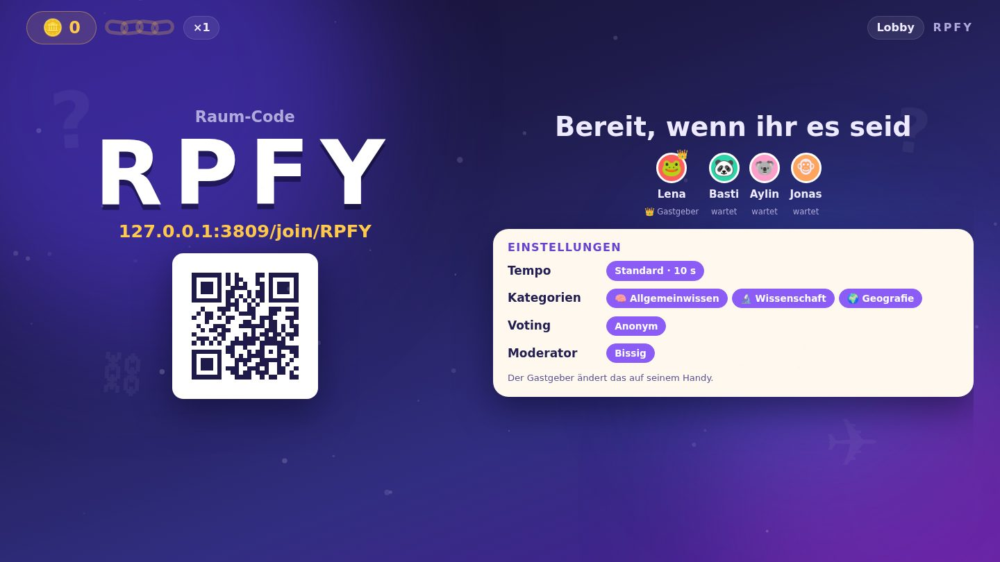
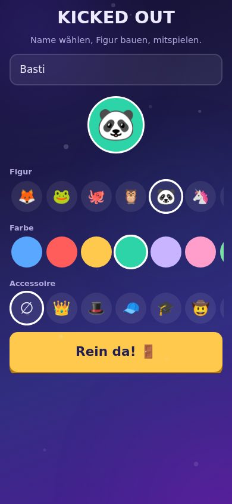
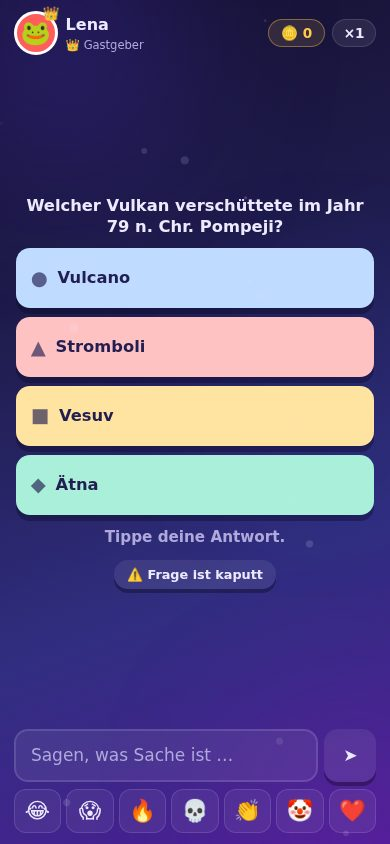
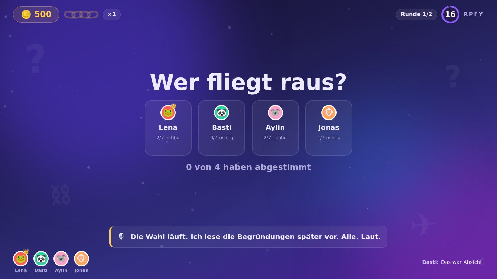
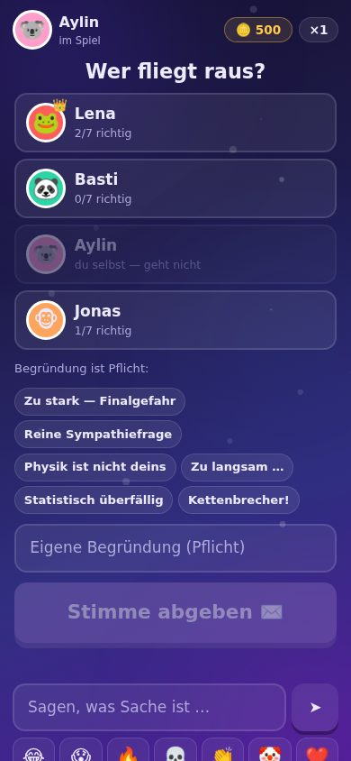
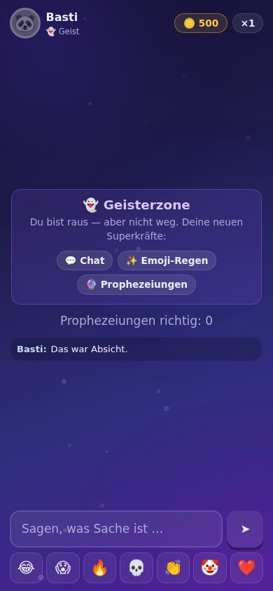

# KICKED OUT — Der Dümmste fliegt 🚪💨

Ein Browser-Partyquiz für **4–9 echte Menschen** in Echtzeit, gebaut nach dem Jackbox-Prinzip: Ein großer Screen ist die Bühne, jedes Smartphone wird zum persönlichen Buzzer. Kein Download, keine Accounts, keine KI-Mitspieler — nur ein bissiger KI-Moderator, der die Rauswürfe kommentiert.

```
git clone https://github.com/Trikophalo/KickedOut.git
cd KickedOut
npm install
npm start
```

Dann am großen Screen `http://localhost:3000/host` öffnen, und alle anderen scannen den QR-Code. Im WLAN erreichen die Handys den Server unter der lokalen IP des Hosts (z. B. `http://192.168.1.42:3000`) — der QR-Code auf der Bühne zeigt genau diese Adresse an.

---

## So sieht das aus

| Bühne (der große Screen) | Handy (der Controller) |
|---|---|
|  |  |
| **Lobby** — Raum-Code, QR und die Runde füllt sich | **Beitritt** — Name und Figur in zehn Sekunden |
|  |  |
| **Auflösung** — die Avatare springen auf ihre Wahl | **Fragerunde** — vier Buttons, sonst nichts |
|  |  |
| **Voting** — Bilanz sichtbar, Stimmen nicht | **Abstimmen** — ohne Begründung geht der Knopf nicht auf |
|  |  |
| **Rausschmiss** — Spotlight, Stempel, Katapult | **Geisterzone** — raus, aber nicht weg |

<sub>Screenshots automatisch erzeugt von `scripts/browsertest.js`, das eine komplette Partie in echtem Chromium durchspielt. Die Schrift ist hier die Fallback-Variante — in der Sandbox war Google Fonts nicht erreichbar.</sub>

---

## So läuft eine Partie

| Phase | Was passiert |
|---|---|
| **Lobby** | Raum-Code und QR-Code auf der Bühne. Alle bauen sich in zehn Sekunden eine Figur. |
| **Fragerunde** | 7 Fragen, **alle antworten gleichzeitig**. Beim Reveal springen die Avatare auf die Option, die sie gewählt haben — man sieht sofort, wer „Sydney" für Australiens Hauptstadt hielt. |
| **Kette & Pott** | Jede richtige Antwort zahlt `Wert × Multiplikator` in den gemeinsamen Pott. Beantworten **alle** eine Frage richtig, wird ein Kettenglied geschmiedet (bis ×5). **Eine einzige falsche Antwort friert die Kette ein** — Frost, Splittern, zurück auf ×1. Und alle sehen, wer schuld war. |
| **Voting** | Anonym, mit **Pflicht-Begründung**. Ohne Begründung geht der Absenden-Knopf nicht auf. |
| **Rausschmiss** | Vote-Karten fliegen einzeln ein, Begründungen erscheinen als anonyme Sprechblasen, der Moderator liest die beste vor — dann Spotlight, Stempel **„DU FLIEGST!"**, Katapult. |
| **Geisterzone** | Rausgeflogene bleiben im Spiel: Chat, Emoji-Regen auf die Bühne und Prophezeiungen, wer als Nächstes fliegt. |
| **Finale** | Die letzten zwei duellieren sich Best-of-5. Kategorien-Draft, beide richtig → der Schnellere punktet. Frage 5 ist immer „Chaos". |
| **Ergebnis** | Krönung mit Konfetti (die Menge skaliert mit dem Pott), Awards, Highlight-Recap, Revanche-Knopf. |

Bei 8–9 Spielern fliegen in den ersten Runden zwei auf einmal — so bleibt der Abend bei 25–40 Minuten.

---

## Was das Spiel besonders macht

**Die Spoiler-Schleuse.** Solange das Antwortfenster offen ist, werden Chat-Nachrichten lebender Spieler serverseitig gepuffert und erst beim Reveal gesammelt freigelassen. Niemand kann „C!!!" vorsagen — und der Nachrichtenschwall zur Auflösung ist ein eigener Comedy-Beat. Geister reden ungebremst weiter.

**Der Moderator wiederholt sich nie.** 624 Sprüche über 19 Situationen und drei Härtegrade (charmant / bissig / gnadenlos), mit Verbraucht-Set pro Lobby. Allein für den Rausschmiss stehen 96 Zeilen bereit — Bahnhofsdurchsage, Wetterbericht, Nachruf, Behördendeutsch.

**Fragen sind Frischware.** Ein kuratierter Grundstock von 180 Fragen ist immer da; im Hintergrund erzeugt eine Pipeline laufend neue aus **Wikidata**-Fakten-Tripeln mit deutschen Labels. Wiederholungsfreiheit über drei Ebenen: Session-Sperre, 90-Tage-Gruppengedächtnis und Fakten-Key-Cooldown (auch die *umgedrehte* Hauptstadt-Frage pausiert mit).

**Sound ohne eine einzige Audio-Datei.** Alle 31 Klänge — Amboss, Eisknacken, Trommelwirbel, Sieger-Fanfare — sind zur Laufzeit mit Web Audio synthetisiert. Die Musik ist geschichtet: Mit jeder Runde kommt eine Ebene dazu, Runde 5 klingt gefährlicher als Runde 1.

**Der QR-Code kommt aus dem eigenen Code.** Eigener Encoder (Byte-Modus, Fehlerkorrektur L) — ein QR-Dienst aus dem Netz wäre genau dann weg, wenn man ihn im Wohnzimmer-WLAN braucht.

---

## Bedienung

| Adresse | Wofür |
|---|---|
| `/` | Einstieg: Bühne öffnen oder mit Code beitreten |
| `/host` | Die Bühne (Fernseher, Beamer, Laptop) |
| `/join/CODE` | Der Handy-Controller |
| `/watch/CODE` | Bühne noch einmal öffnen — z. B. für einen zweiten Screen |
| `/api/health` | Poolgesundheit, laufende Räume, Fragen-Statistik |

Der **erste Spieler, der beitritt, ist der Gastgeber**: Er stellt Tempo, Kategorien, Voting-Modus und Moderator-Härtegrad auf seinem Handy ein, startet das Spiel und hat während einer Frage einen Notfallknopf („Frage ist kaputt"), der sie sofort austauscht und meldet.

---

## Technik

Ein Node-Server, eine Abhängigkeit (`ws`), kein Build-Schritt. Das Frontend sind reine ES-Module, die der Browser direkt lädt.

```
server/
  index.js          HTTP + WebSocket, statische Auslieferung
  room.js           Autoritative Zustandsmaschine (alle 16 Phasen)
  config.js         Werte-Rampe, Timings, Rausschmiss-Plan
  questions/        Pool, Qualitätsprüfung, Wikidata, OpenTDB, LLM-Stufen
  moderator/        624 Sprüche + Auswahl ohne Wiederholung
public/
  host.html         Bühne          js/stage.js
  play.html         Controller     js/controller.js
  js/audio.js       Synthesizer für alle Klänge und die Schichtenmusik
  js/fx.js          Konfetti, Funken, Emoji-Regen, Frost
  js/qr.js          QR-Encoder
scripts/
  selftest.js       Spielt eine Partie über WebSockets durch
  browsertest.js    Spielt eine Partie in echtem Chromium durch
```

**Der Server hat immer recht.** Punkte, Timer, Votes und Lösungen leben ausschließlich serverseitig. Die richtige Antwort verlässt den Server erst mit der Auflösung — vorher existiert sie für keinen Client, auch nicht für die Bühne. Wer wen gewählt hat, verlässt den Server im Anonym-Modus überhaupt nie. Beides prüft der Selbsttest gegen jeden einzelnen Zustand.

**Der Spielpfad hat zur Laufzeit keine externen Abhängigkeiten.** Fragen werden beim Spielstart als Vorrat reserviert; ob Wikidata gerade erreichbar ist, kann eine laufende Partie nicht mehr stören.

**Funkloch ist kein Rauswurf.** Die Sitzung hängt an einem Token, nicht an der Verbindung. Wer rausfliegt und neu lädt, ist wieder drin; eine verpasste Frage zählt als falsch, mehr nicht.

### Tests

```bash
npm test                              # Serverlogik, komplette Partie über WebSockets
KO_TEST_PLAYERS=9 npm test            # mit Doppelrausschmiss
node scripts/browsertest.js           # echtes Chromium, Screenshots in ./screenshots/
```

Beide Tests starten den echten Server im Zeitraffer (`KO_TIME_SCALE`) und spielen eine vollständige Partie durch. Der Selbsttest prüft 34 Zusagen, darunter die beiden, die man an einem Spieleabend nicht mehr nachbessern kann: dass die Lösung nie vor der Auflösung ausgeliefert wird und dass die Zuordnung Stimme→Wähler den Server nie verlässt. Der Browser-Test meldet jeden Konsolenfehler und jede Ausnahme auf Bühne und Handy — er hat unter anderem ein unsichtbares Overlay gefunden, das auf dem Handy jeden Tap verschluckt hätte.

### Umgebungsvariablen

| Variable | Wirkung |
|---|---|
| `PORT` | Server-Port (Standard 3000) |
| `KO_TIME_SCALE` | Zeitraffer für alle Choreografie-Dauern, z. B. `0.02` für Tests |
| `KO_NO_REFILL=1` | Kein Nachschub aus externen Quellen |
| `KO_DATA_DIR` | Ablage für Telemetrie und Gruppen-Gedächtnis (Standard `./data`) |
| `ANTHROPIC_API_KEY` | Schaltet die optionalen LLM-Stufen der Fragen-Pipeline frei (siehe unten) |

### Optionale LLM-Stufen

Ohne API-Schlüssel lebt der Pool vom kuratierten Grundstock plus Wikidata — beides quellengeprüft. Mit `ANTHROPIC_API_KEY` und `npm install @anthropic-ai/sdk` kommen zwei Stufen dazu:

1. **Lokalisierer** — formt englische Rohfragen aus OpenTDB zu natürlichem Deutsch um (Maße, Bezugsraum, Kulturkontext), nicht Wort für Wort.
2. **Blind-Solver** — beantwortet jede neue Frage, *ohne* die vorgesehene Lösung zu kennen, und stuft jeden Distraktor ein. Weicht er ab oder hält er eine Frage für mehrdeutig, fliegt sie raus.

Die beiden Rollen sollten auf **verschiedenen Modellen** laufen — unabhängige Fehler sind der ganze Sinn der Prüfung. Steuerbar über `KO_LLM_MODEL` und `KO_SOLVER_MODEL`. Beides läuft ausschließlich im asynchronen Nachschub-Job, nie im Spielpfad.

---

## Barrierefreiheit

Richtig und falsch werden nie allein über Farbe transportiert (Symbol, Form und Position kommen dazu), die Bühnen-Typografie ist auf drei Meter Abstand ausgelegt, und `prefers-reduced-motion` schaltet alle Bewegung auf ruhige Varianten um. Haptik auf dem Handy ist immer nur Würze, nie Informationsträger — iOS Safari kann keine Vibration.

---

## Konzept

Das vollständige Konzept- und Umsetzungsdokument (Spielablauf, UI/UX pro Screen, Sound- und Animationsmomente, Fragen-Pipeline, Zusatzfeatures, Architektur, Roadmap) liegt in **[KONZEPT.md](./KONZEPT.md)**.

Der Umsetzungsstand entspricht dem dort beschriebenen MVP plus Teilen von V1 (Geister-Tipps, Moderator-Härtegrade, Melde- und Kalibrier-Kreislauf, Beobachter-Link). Offen aus V1/V1.1: Stammtisch-Rangliste, eigene Fragen-Packs, teilbare Recap-Karte, Sabotage-Joker, TTS-Moderator.

---

## Rechtliches

Eigenständige Umsetzung der Spielidee (Quiz + Gewinnkette + Rauswahl). Keine geschützten Namen, Logos oder Catchphrases der TV-Formate — unser Satz ist „Du fliegst!". Fragen aus OpenTDB tragen ihren Lizenzhinweis (CC BY-SA 4.0) im Datensatz mit, Wikidata-Fakten stehen unter CC0.

Keine Accounts, keine E-Mail-Adressen, kein Tracking. Der Chat wird nie persistiert, Telemetrie ist anonymisiert.
