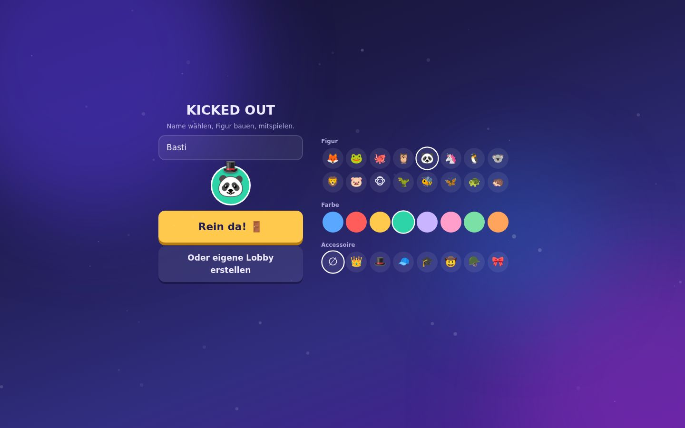
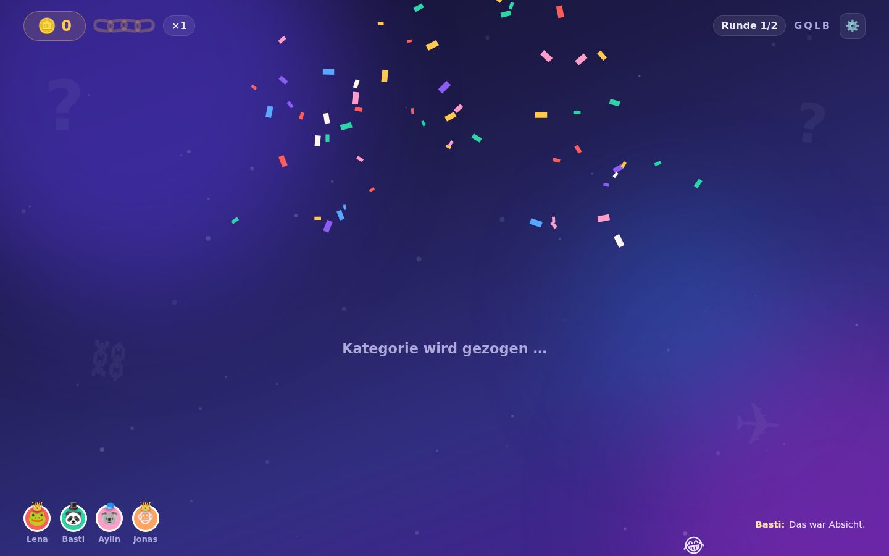
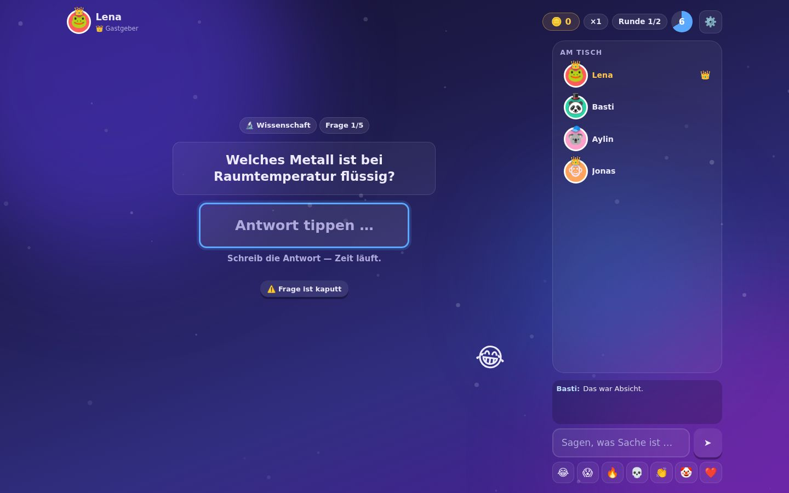
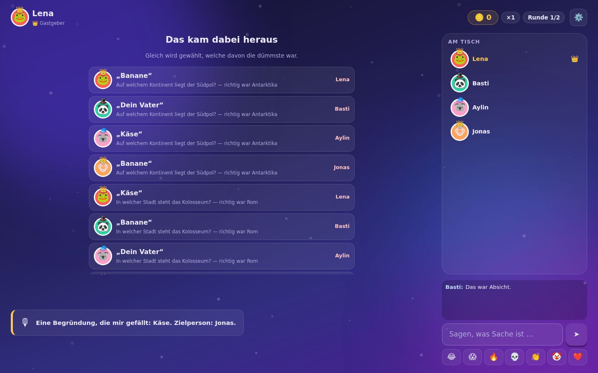
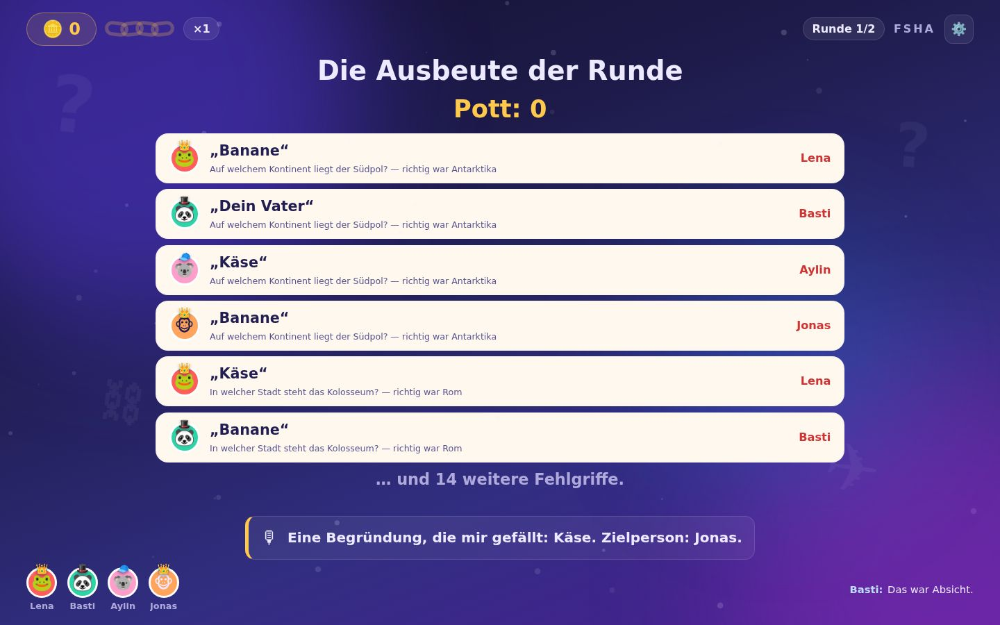
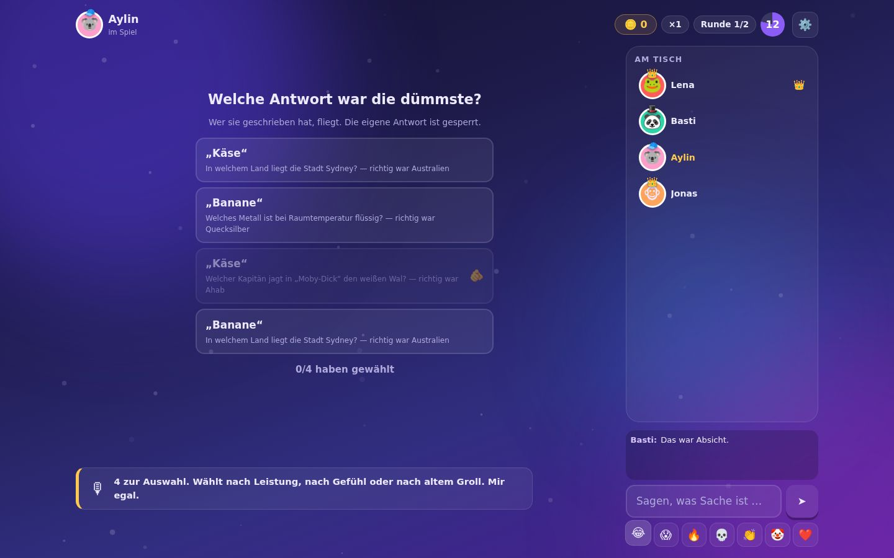
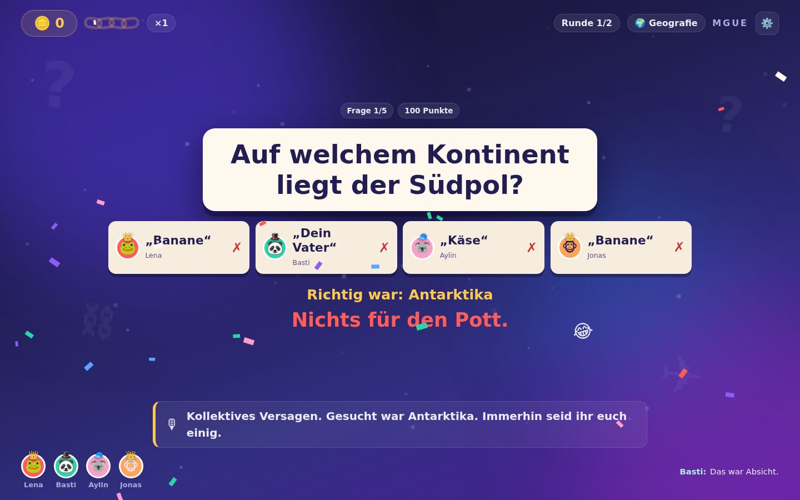
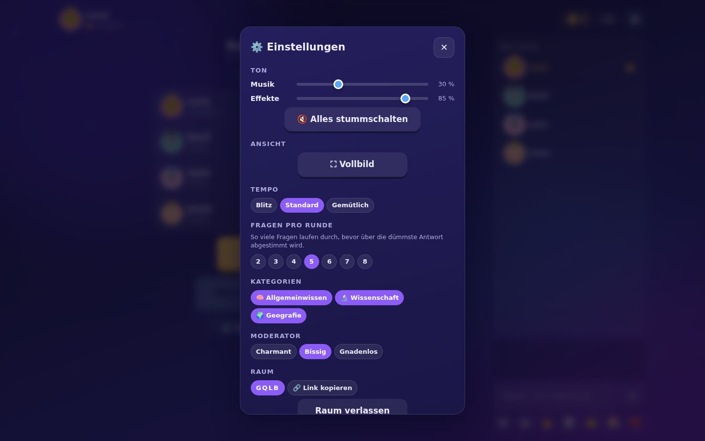
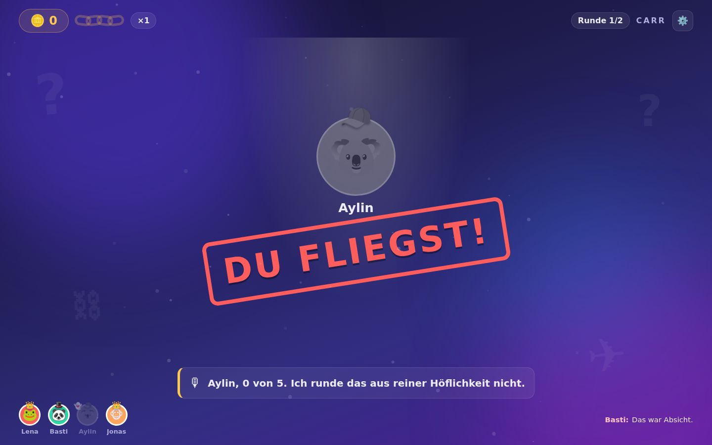

# KICKED OUT — Der Dümmste fliegt 🚪💨

Ein Browser-Partyquiz für **2–9 echte Menschen** in Echtzeit. Jede Antwort wird **frei getippt** — keine Auswahlmöglichkeiten, kein Raten per Klick. Unter Zeitdruck entstehen genau die Antworten, um die es eigentlich geht, und am Ende jeder Runde wählt die Runde die **dümmste**. Wer sie geschrieben hat, fliegt.

Läuft am PC genauso wie am Handy: Wer die Lobby erstellt, spielt im selben Fenster mit. Kein Download, keine Accounts, keine KI-Mitspieler — nur ein bissiger KI-Moderator, der die Rauswürfe kommentiert.

```
git clone https://github.com/Trikophalo/KickedOut.git
cd KickedOut
npm install
npm start
```

Dann `http://localhost:3000` öffnen → **Lobby erstellen** → den Link an die Mitspieler schicken. Jeder spielt in seinem eigenen Fenster; am PC steht dabei alles auf einem Bildschirm (Frage, Eingabe, Mitspieler, Chat).

Sitzt ihr im selben Raum an einem Fernseher? Dann zusätzlich `http://localhost:3000/host` als gemeinsame Bühne öffnen — dort erscheint ein QR-Code, den die Handys scannen.

---

## So sieht das aus

| Am PC — alles auf einem Bildschirm | Auf dem großen Screen |
|---|---|
|  |  |
| **Beitritt** — alle Figuren auf einen Blick, ohne Scrollen | **Kategorie-Zug** — die Walze rastet vor jeder Frage ein |
|  |  |
| **Fragerunde** — tippen statt klicken, Mitspieler und Chat rechts | **Bühne** — wer schon fertig ist, sieht man; was er schrieb, nicht |
|  |  |
| **Rundenbilanz** — jeder Fehlgriff mit Namen | **… und auf der Leinwand für alle** |
|  |  |
| **Voting** — welche Antwort war die dümmste? | **Auflösung** — jetzt liegt alles offen |
|  |  |
| **Einstellungen** — Zahnrad oder Escape | **Rausschmiss** — Spotlight, Stempel, Katapult |

<sub>Screenshots automatisch erzeugt von `scripts/browsertest.js`, das eine komplette Partie in echtem Chromium durchspielt. Die Schrift ist hier die Fallback-Variante — in der Sandbox war Google Fonts nicht erreichbar.</sub>

---

## So läuft eine Partie

| Phase | Was passiert |
|---|---|
| **Lobby erstellen** | Schon im Beitrittsbild wählt man die **Fragen-Genres**. Am PC steht alles gleichzeitig da: Name, Vorschau und sämtliche Figuren, ohne eine einzige Rollleiste. |
| **Lobby** | Wer erstellt, bekommt einen Code zum Weitergeben. Alle bauen sich in zehn Sekunden eine Figur — Accessoire sitzt mittig auf dem Kopf. Der Gastgeber kann erst starten, wenn **alle bereit** sind; dann läuft der Start nach **10 Sekunden von selbst** an. Ein erneuter Klick auf „Bereit" hält ihn wieder an. |
| **Kategorie-Zug** | Vor **jeder** Frage rattert eine Walze durch die freigeschalteten Genres und rastet hörbar auf einem ein. |
| **Fragerunde** | Standardmäßig 5 Fragen (in der Lobby von 2 bis 8 einstellbar), **alle tippen gleichzeitig**. Die Bewertung verzeiht Tippfehler, Buchstabendreher, fehlende Umlaute und Artikel — aber keine falsche Antwort. Beim Reveal liegt alles offen: Man sieht sofort, wer „Käse" für die chemische Formel von Wasser hielt. |
| **Kette & Pott** | Jede richtige Antwort zahlt `Wert × Multiplikator` in den gemeinsamen Pott. Beantworten **alle** eine Frage richtig, wird ein Kettenglied geschmiedet (bis ×5). **Eine einzige falsche Antwort friert die Kette ein** — Frost, Splittern, zurück auf ×1. Und alle sehen, wer schuld war. |
| **Rundenbilanz** | Bevor gewählt wird, kommt **alles Falsche der Runde mit Namen** auf die Leinwand. Das ist der Lacher, aus dem die Stimmen entstehen. |
| **Voting** | Pro Spieler landet **eine Antwort** auf dem Stimmzettel — bevorzugt eine falsche. Man wählt die dümmste; die eigene ist gesperrt. Auf dem Zettel stehen keine Namen, die fallen erst bei der Auszählung. |
| **Rausschmiss** | Man fliegt **einzig** über dieses Voting raus, nie über Punkte. Die Stimmen tropfen einzeln auf die Karten, dann fallen die Namen — und die meistgewählte Antwort kostet ihren Urheber den Platz. Spotlight, Stempel **„DU FLIEGST!"**, Katapult. |
| **Geisterzone** | Rausgeflogene bleiben im Spiel: Chat, Emoji-Regen auf die Bühne und Prophezeiungen, wer als Nächstes fliegt. |
| **Finale** | Die letzten zwei duellieren sich Best-of-5. Kategorien-Draft, beide richtig → der Schnellere punktet. Frage 5 ist immer „Chaos". **Zu zweit** geht es sofort hierhin — ohne Rausschmiss, direkt ins Duell. |
| **Ergebnis** | Krönung mit Konfetti (die Menge skaliert mit dem Pott), Awards, Highlight-Recap, Revanche-Knopf. |

Bei 8–9 Spielern fliegen in den ersten Runden zwei auf einmal — so bleibt der Abend bei 25–40 Minuten.

**Einstellungen** öffnet das Zahnrad oder **Escape**: Musik und Effekte getrennt regelbar, alles stummschaltbar, Vollbild — und für den Gastgeber Tempo, Fragen pro Runde, Kategorien und Moderator-Härtegrad.

Alles, was erklärungsbedürftig ist, erklärt sich beim Überfahren mit der Maus — der Hinweis erscheint **unter** dem Element, damit er nie verdeckt, worauf man gerade zeigt.

---

## Was das Spiel besonders macht

**Freitext, der nicht nervt.** Die Bewertung nutzt Damerau-Levenshtein, versteht `ä`→`ae` genauso wie `ä`→`a`, wirft Artikel und Füllwörter weg, kennt ausgeschriebene Zahlen und lässt bei mehrwortigen Lösungen den Nachnamen genügen. „Zürcih", „W. A. Mozart" und „acht" zählen. „Meiose" statt „Mitose" nicht — sonst wäre der Zeitdruck weg, aus dem die lustigen Antworten entstehen.

**Die Spoiler-Schleuse.** Solange das Antwortfenster offen ist, sieht niemand, was die anderen tippen — die Bühne zeigt nur, wer schon fertig ist. Chat-Nachrichten lebender Spieler werden serverseitig gepuffert und erst beim Reveal gesammelt freigelassen. Geister reden ungebremst weiter.

**Der Moderator wiederholt sich nie.** 624 Sprüche über 19 Situationen und drei Härtegrade (charmant / bissig / gnadenlos), mit Verbraucht-Set pro Lobby. Allein für den Rausschmiss stehen 96 Zeilen bereit — Bahnhofsdurchsage, Wetterbericht, Nachruf, Behördendeutsch. Am Rundenende liest er die kurioseste Antwort vor.

**Fragen sind Frischware.** Ein kuratierter Grundstock von 180 Fragen ist immer da; im Hintergrund erzeugt eine Pipeline laufend neue aus **Wikidata**-Fakten-Tripeln mit deutschen Labels. Wiederholungsfreiheit über drei Ebenen: Session-Sperre, 90-Tage-Gruppengedächtnis und Fakten-Key-Cooldown (auch die *umgedrehte* Hauptstadt-Frage pausiert mit).

**Sound ohne eine einzige Audio-Datei.** Alle 31 Klänge — Amboss, Eisknacken, Trommelwirbel, Sieger-Fanfare — sind zur Laufzeit mit Web Audio synthetisiert. Die Musik ist geschichtet: Mit jeder Runde kommt eine Ebene dazu, Runde 5 klingt gefährlicher als Runde 1.

**Der QR-Code kommt aus dem eigenen Code.** Eigener Encoder (Byte-Modus, Fehlerkorrektur L) — ein QR-Dienst aus dem Netz wäre genau dann weg, wenn man ihn im Wohnzimmer-WLAN braucht.

---

## Bedienung

| Adresse | Wofür |
|---|---|
| `/` | Einstieg: Lobby erstellen oder mit Code beitreten |
| `/play?neu=1` | Lobby erstellen und direkt mitspielen |
| `/join/CODE` | Mitspielen — am PC mit voller Ansicht, am Handy kompakt |
| `/host` | Zusätzliche Bühne für einen geteilten Screen |
| `/watch/CODE` | Bühne noch einmal öffnen — z. B. für einen zweiten Screen |
| `/api/health` | Poolgesundheit, laufende Räume, Fragen-Statistik |

Wer die **Lobby erstellt, ist der Gastgeber**: Er stellt Tempo, Fragen pro Runde, Kategorien und Moderator-Härtegrad im Einstellungs-Fenster ein, startet das Spiel und hat während einer Frage einen Notfallknopf („Frage ist kaputt"), der sie sofort austauscht und meldet.

---

## Technik

Ein Node-Server, eine Abhängigkeit (`ws`), kein Build-Schritt. Das Frontend sind reine ES-Module, die der Browser direkt lädt.

```
server/
  index.js          HTTP + WebSocket, statische Auslieferung
  room.js           Autoritative Zustandsmaschine (alle 17 Phasen)
  config.js         Werte-Rampe, Timings, Rausschmiss-Plan
  questions/        Pool, Qualitätsprüfung, Wikidata, OpenTDB, LLM-Stufen
    grade.js        Bewertung freier Texteingaben
  moderator/        624 Sprüche + Auswahl ohne Wiederholung
public/
  host.html         Bühne          js/stage.js
  play.html         Controller     js/controller.js
  js/audio.js       Synthesizer für alle Klänge und die Schichtenmusik
  js/fx.js          Konfetti, Funken, Emoji-Regen, Frost
  js/qr.js          QR-Encoder
  js/settings.js    Einstellungs-Fenster (Zahnrad / Escape)
scripts/
  selftest.js       Spielt eine Partie über WebSockets durch
  browsertest.js    Spielt eine Partie in echtem Chromium durch
```

**Der Server hat immer recht.** Punkte, Timer, Votes und Lösungen leben ausschließlich serverseitig. Die richtige Antwort verlässt den Server erst mit der Auflösung — vorher existiert sie für keinen Client, auch nicht für die Bühne. Wer wen gewählt hat, verlässt den Server im Anonym-Modus überhaupt nie. Beides prüft der Selbsttest gegen jeden einzelnen Zustand.

**Der Spielpfad hat zur Laufzeit keine externen Abhängigkeiten.** Fragen werden beim Spielstart als Vorrat reserviert; ob Wikidata gerade erreichbar ist, kann eine laufende Partie nicht mehr stören.

**Funkloch ist kein Rauswurf.** Die Sitzung hängt an einem Token, nicht an der Verbindung. Wer rausfliegt und neu lädt, ist wieder drin; eine verpasste Frage zählt als falsch, mehr nicht.

### Tests

```bash
npm test                              # Serverlogik, komplette Partie über WebSockets
KO_TEST_PLAYERS=9 npm test            # mit Doppelrausschmiss
node scripts/browsertest.js           # echtes Chromium, Screenshots in ./screenshots/
```

Beide Tests starten den echten Server im Zeitraffer (`KO_TIME_SCALE`) und spielen eine vollständige Partie durch. Der Selbsttest prüft 34 Zusagen, darunter die beiden, die man an einem Spieleabend nicht mehr nachbessern kann: dass die Lösung nie vor der Auflösung ausgeliefert wird und dass die Zuordnung Stimme→Wähler den Server nie verlässt. Der Browser-Test meldet jeden Konsolenfehler und jede Ausnahme auf Bühne und Handy — er hat unter anderem ein unsichtbares Overlay gefunden, das auf dem Handy jeden Tap verschluckt hätte.

### Umgebungsvariablen

| Variable | Wirkung |
|---|---|
| `PORT` | Server-Port (Standard 3000) |
| `KO_TIME_SCALE` | Zeitraffer für alle Choreografie-Dauern, z. B. `0.02` für Tests |
| `KO_NO_REFILL=1` | Kein Nachschub aus externen Quellen |
| `KO_DATA_DIR` | Ablage für Telemetrie und Gruppen-Gedächtnis (Standard `./data`) |
| `ANTHROPIC_API_KEY` | Schaltet die optionalen LLM-Stufen der Fragen-Pipeline frei (siehe unten) |

### Optionale LLM-Stufen

Ohne API-Schlüssel lebt der Pool vom kuratierten Grundstock plus Wikidata — beides quellengeprüft. Mit `ANTHROPIC_API_KEY` und `npm install @anthropic-ai/sdk` kommen zwei Stufen dazu:

1. **Lokalisierer** — formt englische Rohfragen aus OpenTDB zu natürlichem Deutsch um (Maße, Bezugsraum, Kulturkontext), nicht Wort für Wort.
2. **Blind-Solver** — beantwortet jede neue Frage, *ohne* die vorgesehene Lösung zu kennen, und stuft jeden Distraktor ein. Weicht er ab oder hält er eine Frage für mehrdeutig, fliegt sie raus.

Die beiden Rollen sollten auf **verschiedenen Modellen** laufen — unabhängige Fehler sind der ganze Sinn der Prüfung. Steuerbar über `KO_LLM_MODEL` und `KO_SOLVER_MODEL`. Beides läuft ausschließlich im asynchronen Nachschub-Job, nie im Spielpfad.

---

## Barrierefreiheit

Richtig und falsch werden nie allein über Farbe transportiert (Symbol, Form und Position kommen dazu), die Bühnen-Typografie ist auf drei Meter Abstand ausgelegt, und `prefers-reduced-motion` schaltet alle Bewegung auf ruhige Varianten um. Haptik auf dem Handy ist immer nur Würze, nie Informationsträger — iOS Safari kann keine Vibration.

---

## Konzept

Das vollständige Konzept- und Umsetzungsdokument (Spielablauf, UI/UX pro Screen, Sound- und Animationsmomente, Fragen-Pipeline, Zusatzfeatures, Architektur, Roadmap) liegt in **[KONZEPT.md](./KONZEPT.md)**.

Der Umsetzungsstand entspricht dem dort beschriebenen MVP plus Teilen von V1 (Geister-Tipps, Moderator-Härtegrade, Melde- und Kalibrier-Kreislauf, Beobachter-Link). Offen aus V1/V1.1: Stammtisch-Rangliste, eigene Fragen-Packs, teilbare Recap-Karte, Sabotage-Joker, TTS-Moderator.

---

## Rechtliches

Eigenständige Umsetzung der Spielidee (Quiz + Gewinnkette + Rauswahl). Keine geschützten Namen, Logos oder Catchphrases der TV-Formate — unser Satz ist „Du fliegst!". Fragen aus OpenTDB tragen ihren Lizenzhinweis (CC BY-SA 4.0) im Datensatz mit, Wikidata-Fakten stehen unter CC0.

Keine Accounts, keine E-Mail-Adressen, kein Tracking. Der Chat wird nie persistiert, Telemetrie ist anonymisiert.
